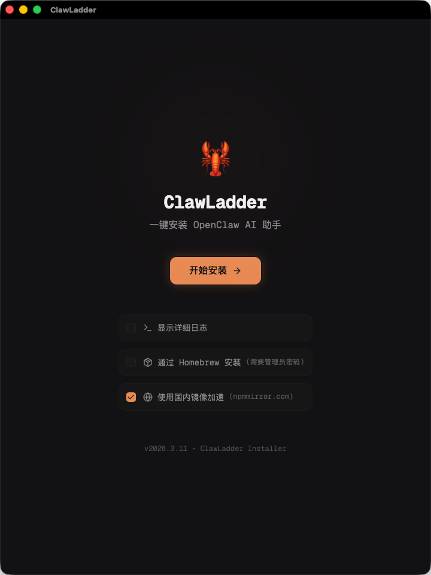
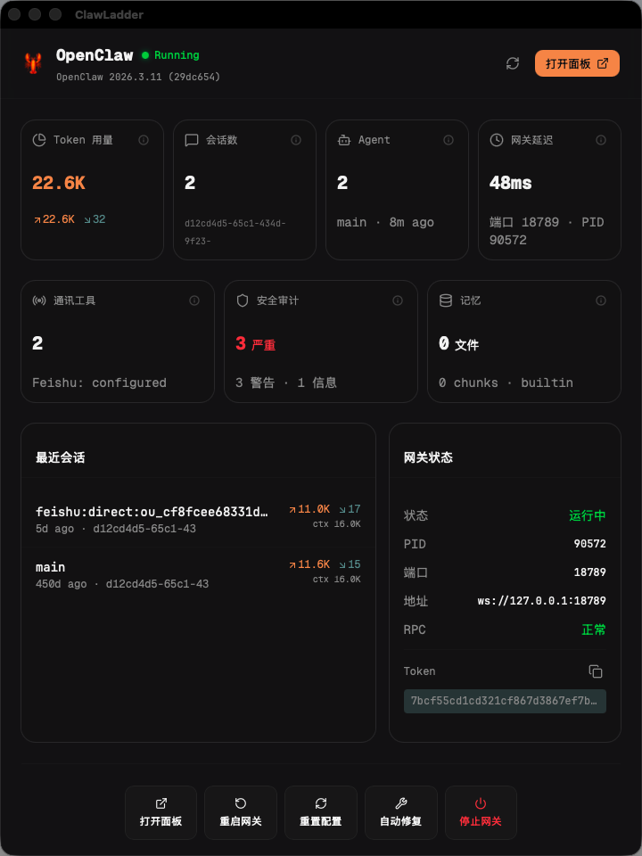

# 🦞 ClawLadder

One-click installer for [OpenClaw](https://github.com/nicepkg/openclaw) on macOS.

Full GUI experience — no terminal required.

| Install Guide | Dashboard |
|:---:|:---:|
|  |  |

## Features

- **One-click install** — Automatically handles Xcode CLT, Node.js, Git and other dependencies, with China mirror support
- **CLI-native** — Deeply integrated with the OpenClaw CLI; no manual config file editing
- **IM integration** — Guided setup for Feishu / Telegram bots, no fiddling with pairing codes
- **Curated Skills** — Community-vetted Skills, install with a checkbox
- **Guided setup** — Full Chinese UI with step-by-step explanations (English UI planned)
- **Dashboard** — Built-in management panel for gateway control, token usage, and config editing

## Install Flow

```
Launch → Paste model API key → Configure IM bots → Pick Skills → Pick Hooks → Done ✅
```

<details>
<summary><b>Technical Details (TL;DR)</b></summary>

Two installation paths:

| | Default (recommended) | Homebrew |
|---|---|---|
| Privileges | No sudo required | Needs admin password |
| Node source | Reuses existing Node ≥ 22 if available, otherwise installs to `~/.clawladder/node` | Managed by Homebrew |
| Best for | Everyone | Existing Homebrew setups |
| China mirror | ✅ npmmirror | — |

Post-install guided configuration:
1. **Model setup** — Enter API keys or OAuth, pick a default model, verify connectivity
2. **IM channels** — Configure Feishu / Telegram bots (optional, can skip)
3. **Skills** — Enable built-in skills or install from ClawHub
4. **Hooks** — Toggle session-memory, boot-md, etc.
5. **Launch gateway** — Write config and start the OpenClaw gateway

## Tech Stack

| Layer | Technology |
|---|---|
| Desktop shell | Tauri 2 (Rust) |
| Frontend | React 19 + TypeScript + Vite |
| UI components | Tailwind CSS + shadcn/ui |
| Backend | Rust + Axum + tokio + portable-pty |
| Package manager | Bun |

### Architecture

Frontend communicates with the local Rust backend via HTTP + WebSocket (default port `3145`). The backend handles PTY management, OpenClaw CLI orchestration, config I/O, and gateway lifecycle control.

### PTY Bridge

Uses `portable-pty` to spawn the user's login shell (`$SHELL -l`) on the Rust side, bridging stdin/stdout to xterm.js in the frontend. Each session maintains an independent 2 MiB ring buffer, supporting concurrent WebSocket clients for live output streaming.

### PATH Resolution

macOS GUI apps inherit a minimal PATH from launchd. On startup, the backend appends Homebrew, nvm, fnm, volta, asdf, mise, bun, nix, `~/.clawladder/node/bin`, and other common paths to ensure `node`, `openclaw`, etc. are discoverable within the PTY environment.

### Installation

- **No-sudo path**: Checks for an existing Node.js ≥ 22 (nvm, fnm, brew, system) and reuses it if found. Otherwise downloads a prebuilt LTS binary to `~/.clawladder/node/`. Then runs `npm install -g openclaw` and appends the executable path to `~/.zshrc`. Never touches `/usr/local` or system directories.
- **Homebrew path**: Runs the bundled `install.sh` via `sudo`, following the standard Homebrew installation flow.

### Config Management

All configuration is performed through the OpenClaw CLI (`openclaw onboard`, `openclaw gateway install/start/stop/restart`). Config lives at `~/.openclaw/openclaw.json` using a loose JSON structure (`serde_json::Value`), supporting dynamic extension of providers, channels, skills, and hooks.

### Gateway Control

`gateway.rs` wraps `openclaw gateway` subcommands (`status`, `start`, `stop`, `restart`, `install`, `url`), parsing `--json` output. The gateway can be registered as a system service for background operation.

### Logging

Runtime logs are written to `~/Library/Application Support/com.jazzen.clawladder/logs/`, with a timestamped log file per launch. Installation logs are stored separately at `~/.clawladder/logs/install/`.

### Token Usage

Scans OpenClaw session JSONL files and aggregates token consumption by date, agent, provider, and model, displayed via the Dashboard.

</details>

## File Paths

| Path | Purpose |
|---|---|
| `~/.clawladder/node/` | Standalone Node.js (only created when no system Node ≥ 22 is found) |
| `~/.clawladder/logs/install/` | Installation logs |
| `~/.openclaw/openclaw.json` | OpenClaw configuration |
| `~/.openclaw/clawladder.json` | ClawLadder installation state |

## macOS Gatekeeper

If you see "damaged and can't be opened" or "can't verify the developer":

```bash
sudo xattr -r -d com.apple.quarantine /Applications/ClawLadder.app
```

## 中文

查看 [README.md](README.md) 获取中文说明。
